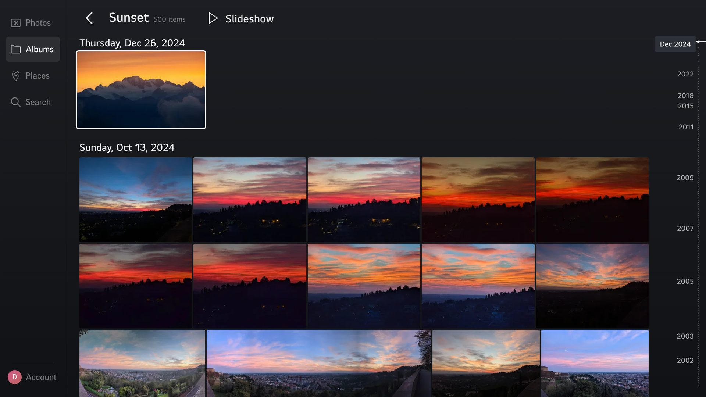
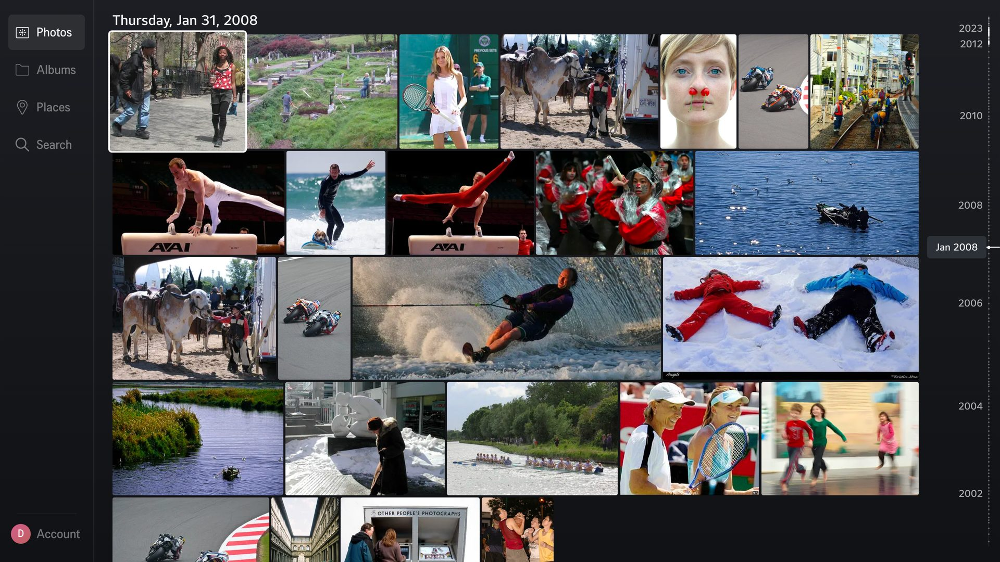
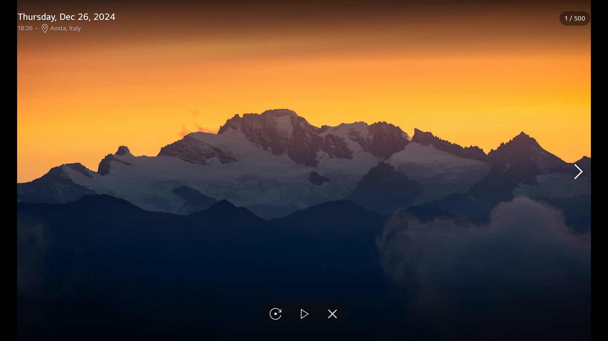
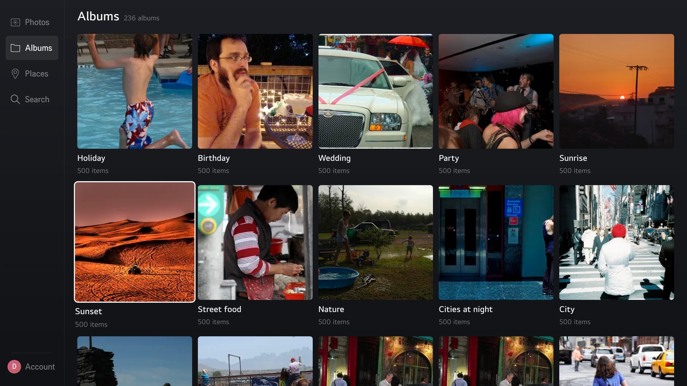
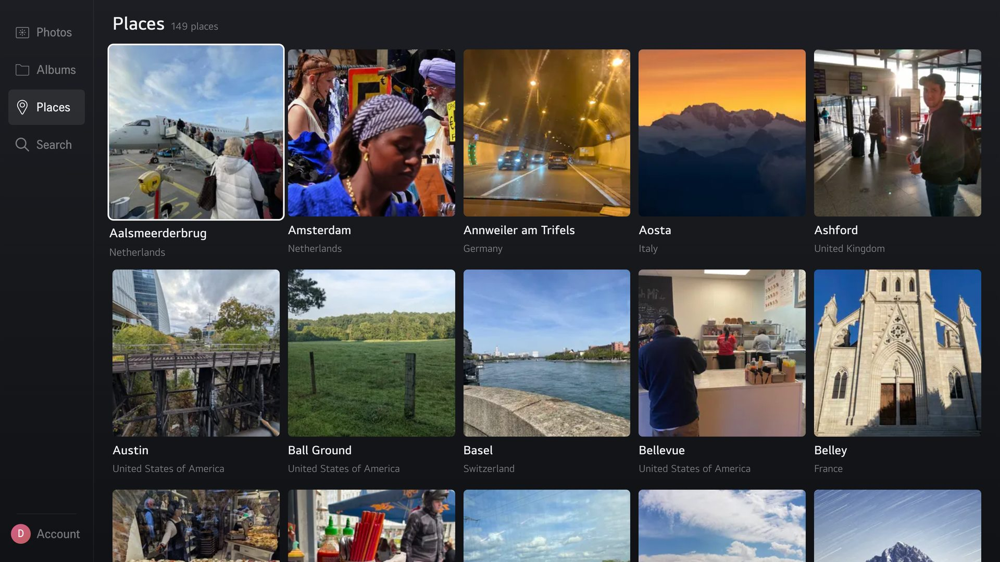
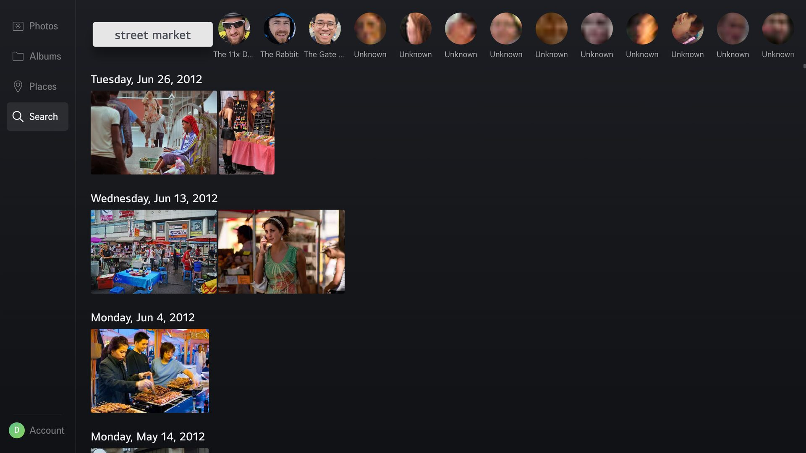
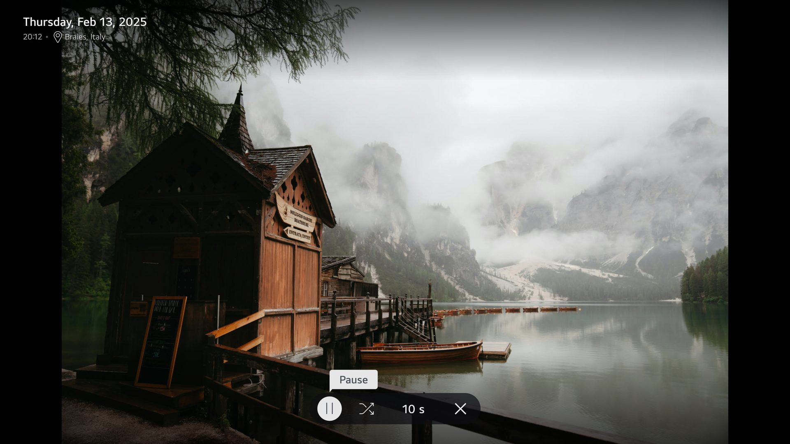
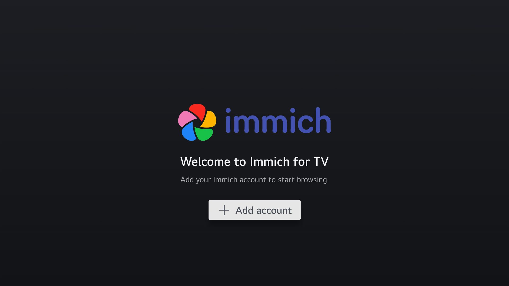
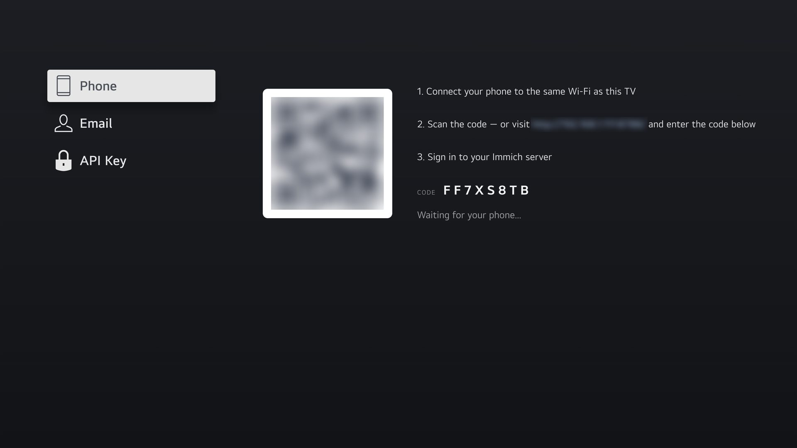

<p align="center">
  
</p>

<h1 align="center">Immich TV</h1>

<p align="center">
  Your self-hosted <a href="https://immich.app/">Immich</a> photo and video library on your LG TV,<br>
  built to be browsed from the couch with the remote.
</p>

<p align="center">
  <a href="https://github.com/Seeky91/immich-tv-webos/releases/latest"></a>
  <a href="https://github.com/Seeky91/immich-tv-webos/releases"></a>
  
  <a href="LICENSE"></a>
</p>

<p align="center">
  <b><a href="https://repo.webosbrew.org/apps/com.seeky91.immichtv">Get it from the webOS Homebrew Channel</a></b>
</p>

<p align="center">
  
</p>

## ✨ Features

- 🖼️ **Timeline** — your whole library, day by day, in a justified grid that keeps every photo's shape. A date scrubber on the right jumps straight to any month or year.
- 🔍 **Full-screen viewer** — date, time and place at a glance, controls that fade away to leave the photo alone, and a rotate button for sideways shots (a local viewing preference: nothing is written to your server).
- 🎞️ **Slideshow** — from any photo, album or place: crossfades, shuffle, adjustable interval, and the TV screen saver stays away while it runs.
- 📁 **Albums and places** — every album, and every city your photos were taken in, each with its own timeline.
- 🔎 **Search** — Immich smart search ("street market", "dog on the beach") and the people Immich recognized.
- ▶️ **Videos** — playback with TV-friendly controls.
- 📱 **Sign in with your phone** — scan a QR code and type your credentials on your phone instead of with the remote. Pairing stays on your home network, and your password is used for one login and never stored.
- 👥 **Several accounts** — add servers or family members and switch between them.
- 🎮 **Made for the remote** — every screen works with the arrow keys; the Magic Remote pointer and scroll wheel work too.

## 📸 Screenshots

<table>
  <tr>
    <td width="50%"></td>
    <td width="50%"></td>
  </tr>
  <tr>
    <td></td>
    <td></td>
  </tr>
  <tr>
    <td></td>
    <td></td>
  </tr>
  <tr>
    <td></td>
    <td></td>
  </tr>
</table>

Captured on an LG OLED TV with the public [Immich demo](https://demo.immich.app).

## 📥 Installation

You need an LG TV running **webOS 5.0 or newer** (2020 models onward) and an Immich server the TV can reach.

### Homebrew Channel (recommended)

1. Install the [webOS Homebrew Channel](https://www.webosbrew.org/) on your TV — see its [install guide](https://www.webosbrew.org/pages/install.html).
2. Open it, find **[Immich TV](https://repo.webosbrew.org/apps/com.seeky91.immichtv)** and install it.
3. Launch Immich TV from your TV's apps, then sign in with your phone, your email and password, or an API key.

New versions show up in the Homebrew Channel.

### Manual install (.ipk)

With your TV in [Developer Mode](https://webostv.developer.lge.com/develop/getting-started/developer-mode-app) and registered with the [webOS CLI](https://webostv.developer.lge.com/develop/tools/cli-installation/), download the `.ipk` from the [latest release](https://github.com/Seeky91/immich-tv-webos/releases/latest) and run:

```bash
ares-install com.seeky91.immichtv_<version>_all.ipk
ares-launch com.seeky91.immichtv
```

## 🛟 Troubleshooting

### "Couldn't reach the server… (CORS)"

The app runs from a `file://` origin and calls the Immich API cross-origin, and Immich sends no CORS headers by default. Whether that matters depends on your TV's firmware:

- **webOS 10 and newer** let installed apps skip CORS: it just works, no server change needed.
- **Older firmwares** enforce CORS like any browser. Immich logs the request as `200 OK`, but the TV drops the response and the sign-in screen shows the error above. This applies to every sign-in method, phone sign-in included: only the login itself goes through the TV's local service, the photos don't.

Allow the app's requests on the reverse proxy in front of Immich. With nginx:

```nginx
add_header Access-Control-Allow-Origin  "*" always;
add_header Access-Control-Allow-Headers "Authorization, x-api-key, Content-Type" always;
add_header Access-Control-Allow-Methods "GET, POST, OPTIONS" always;

if ($request_method = OPTIONS) {
    return 204;
}
```

The same directives work with Caddy, Traefik or any other proxy. The app authenticates with `Authorization` / `x-api-key` headers and uses no cookies, so a wildcard origin is safe here. If your proxy also sends `Cross-Origin-Resource-Policy` or `Cross-Origin-Opener-Policy` headers, remove them for Immich.

`appinfo.json` ships `vendorExtension.allowCrossDomain: true` as a hint to LG's web runtime. The stronger `trustLevel: "netcast"` flag that some webOS apps use to skip CORS is deliberately **not** shipped: it disables `window.PalmServiceBridge` and breaks the on-screen keyboard on webOS 10.

### Photos look soft on a 4K TV

Full-screen photos use the previews Immich generates, 1440 pixels on their short side by default. Recent 4K TVs draw apps in 4K, where that leaves landscape photos slightly upscaled. An Immich admin can raise **Administration → Settings → Image Settings → Preview Settings → Resolution** to **4K**, then run **Generate Thumbnails** on **All** assets from **Administration → Job Queues**. It takes more server storage, applies to the Immich web app too, and larger previews take a little longer to load on older TVs.

## 🛠️ Building from source

### Prerequisites

- **[Node.js](https://nodejs.org/)** 18 or 20
- **[Enact CLI](https://enactjs.com/docs/developer-tools/cli/)** — `npm install -g @enact/cli`
- **[webOS CLI (ares)](https://webostv.developer.lge.com/develop/tools/cli-installation/)** — `npm install -g @webos-tools/cli@3.2.3`
  > Pin `3.2.3`: version `3.2.4` ships a rimraf 6 regression that breaks `ares-package`.

### Setup

```bash
git clone https://github.com/Seeky91/immich-tv-webos.git
cd immich-tv-webos
npm install
```

### Develop

```bash
npm run serve      # dev server with hot reload
```

The dev server runs from `http://localhost`, so the cross-origin rules above still apply. There is no bundled proxy — either configure CORS on your Immich server, or launch Chrome with `--disable-web-security --user-data-dir=/tmp/immich-dev` for local testing.

### Quality gates

```bash
npm run lint       # ESLint (CI treats warnings as errors)
npm run typecheck  # tsc --noEmit — must pass before committing
npm run test       # unit tests
```

### Package & deploy

```bash
npm run pack-p     # production build (Enact pack + legacy transpile pass)
make pack          # build the .ipk
make install       # deploy it to a TV registered as "lg-tv"
make launch        # launch the app
make inspect       # open remote devtools
```

### Architecture

Immich TV is a layered, dependency-injected React app built with [Enact](https://enactjs.com/) and [Sandstone](https://enactjs.com/docs/modules/sandstone/):

- **`src/domain/`** — a `PhotoRepository` interface and a `RepositoryContext` provider. Hooks depend on this abstraction, never on HTTP directly.
- **`src/api/`** — the concrete `ImmichRepository`, the HTTP client, and the Immich response types.
- **`src/hooks/`** — [TanStack Query](https://tanstack.com/query) wrappers for data (assets, albums, search, people, accounts) plus webOS UI hooks (D-pad keys, layout, media viewer).
- **`src/views/` & `src/components/`** — the TV UI, navigated entirely through the webOS Spotlight (D-pad) focus system.
- **`service/`** — a small webOS JS service (Node, zero dependencies) bundled in the `.ipk` that powers phone sign-in: it serves the pairing page over the local network and performs the Immich login from the TV. The app talks to it over the Luna bus; run `node service/dev.js` to develop against it in a desktop browser, and `npm run test-service` for its test suite.

The production bundle is post-processed by `tools/transpile-legacy.mjs`, which re-targets it to Chromium 68 (webOS 5) with esbuild and checks that the result parses. Enact's Babel pass skips `node_modules`, so dependencies shipping modern syntax (e.g. `??=`) would otherwise reach the bundle untransformed and fail to parse on older webOS engines, leaving a black screen.

## ⚖️ Disclaimer

Immich TV is an unofficial, third-party client. It is not affiliated with or endorsed by the Immich project. Provided as-is for personal use on LG Smart TVs.

## 📄 License

MIT © [Quentin Jean-Amans](https://github.com/Seeky91). See [LICENSE](LICENSE).

## 💸 Support

If Immich TV is useful to you, you can leave a tip in Bitcoin — entirely optional, the project is and will remain free and open-source.

```
bc1qvxczfmurlglff6zmkgysnxy2yglvwspalcd373
```
